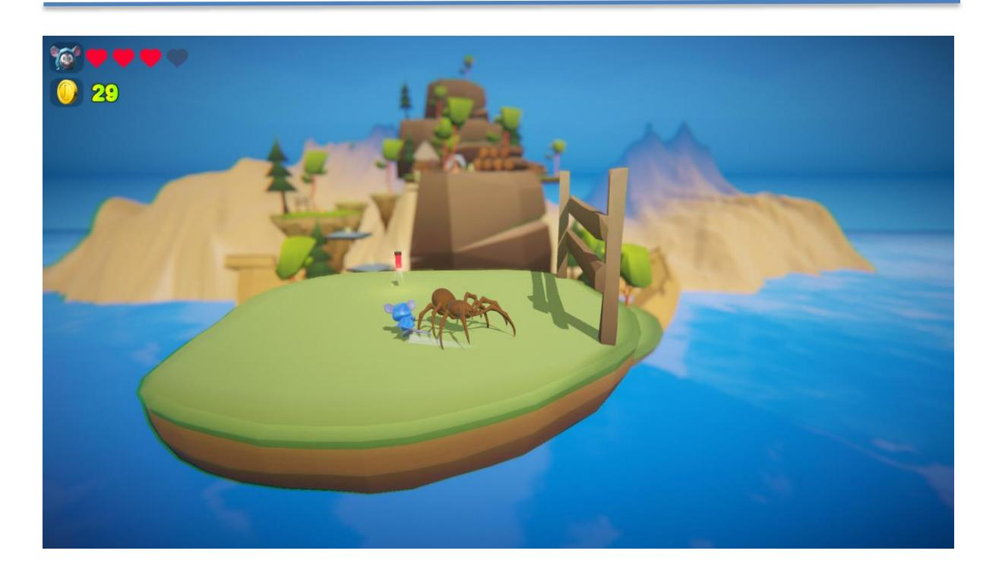

## **Lab 2**

## **MỤC TIÊU**

Kết thúc bài thực hành sinh viên có khả năng:

- ✓Hiểu và áp dụng **Interpolation** để mượt hóa chuyển động trong game.
- ✓Quản lý **FrameRate** để đảm bảo hiệu suất ổn định.
- ✓Sử dụng **Constant Force** để tạo chuyển động liên tục.
- ✓Hiểu và áp dụng **MeshCollider** và **Compound Collider** để tối ưu hệ thống va chạm

#### **NỘI DUNG**

### **[x] Bài tập 1: Áp dụng Interpolation cho game trong mục tài nguyên**

Sinh viên mở dự án đính kèm trong phần tài nguyên, tìm tất cả các RigidBody Component, tiến hành áp dụng Interpolation và mô tả báo cáo về sự thay đổi trước và sau khi áp dụng Interpolation

## **[x] Bài tập 2: Áp dụng FrameRate cho game trong mục tài nguyên**

Sinh viên tiếp tục bổ sung câu lệnh điều chỉnh FrameRate sao cho Game chạy mượt mà trên máy tính nhất mà vẫn đạt FPS tối đa có thể

# **[x] Bài tập 3: Áp dụng Constant Force cho game**

Sinh viên bổ sung chức năng nhân vật bị quay tròn khi bị mất máu sử dụng Constant Force

**[x] Bài 4 : Tìm GameObject sử dụng MeshCollider** 

Tìm kiếm GameObject đang sử dụng MeshCollider sau đó đổi thành Compound Collider. Đảm bảo chức năng trong Game hoạt động bình thường

--- Hết ---