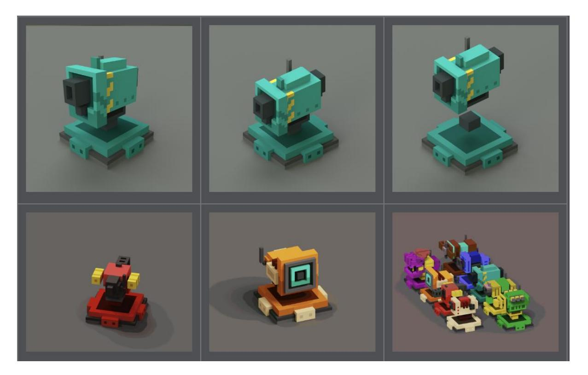
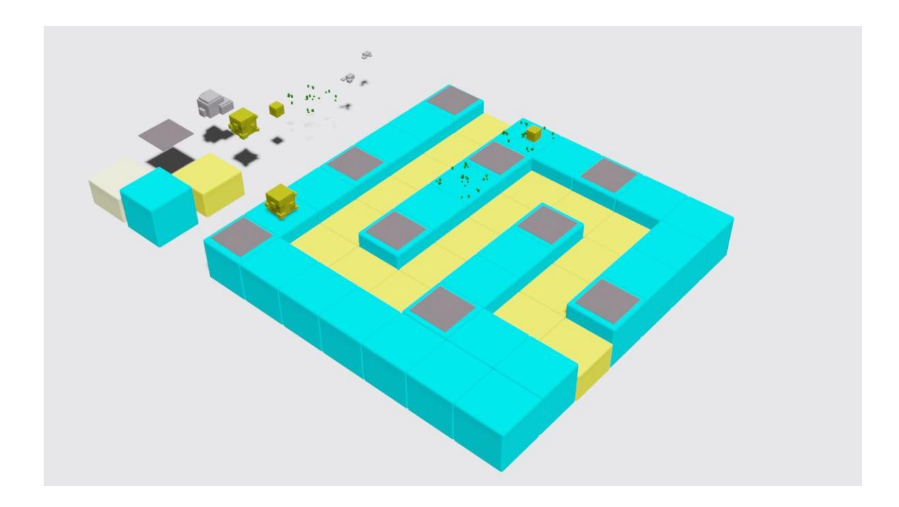
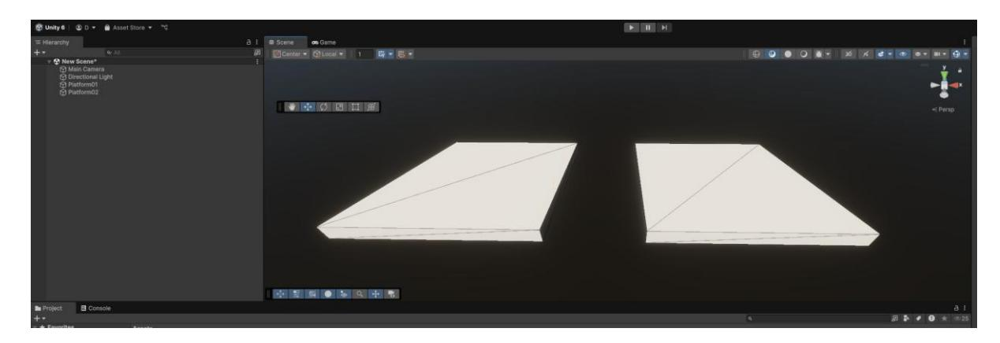
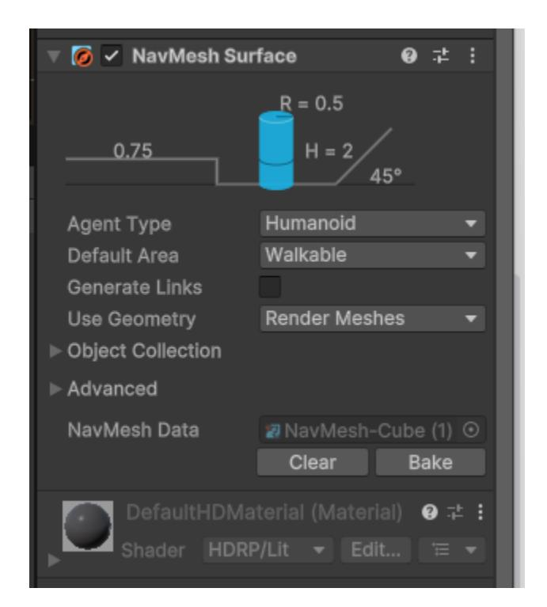
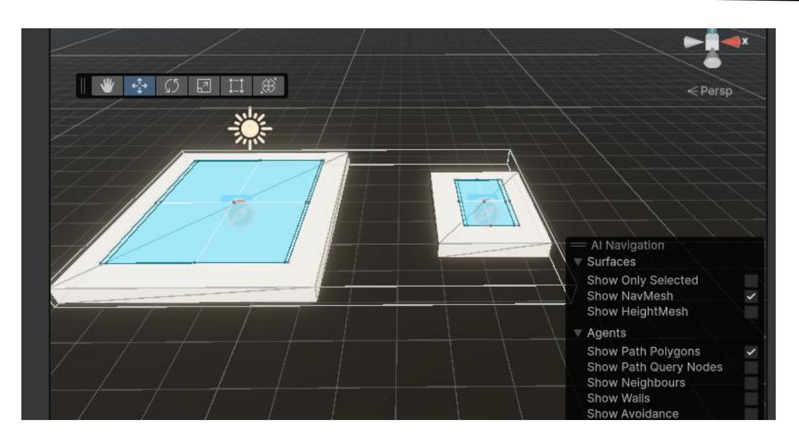
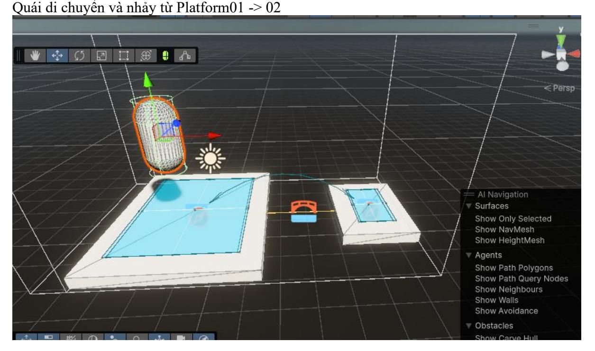

### **Lab 4**

### **MỤC TIÊU**

Kết thúc bài thực hành sinh viên có khả năng:

✓Hiểu và áp dụng **AI Navigation** trong game

✓Hiểu và áp dụng NashMesh Link trong game

✓Áp dụng FSM , NavMesh Agent

#### **NỘI DUNG**

Sinh viên tiến hành tải tài nguyên. Thiết kế Game Phòng Thủ với thiết kế như sau :

# **[x] Bài tập 1: Tạo Navigation và AI di chuyển**

Sinh viên thiết lập Navigation cho Quái di chuyển từ cổng vào tới điểm đích trên đường màu vàng . Khi Quái hoàn thành quãng đường mà không bị tiêu diệt là Game Over

### **[x] Bài tập 2: Súng máy**

Bổ sung các tháp súng máy phòng thủ, ngăn cản các Quái di chuyển

# **Bài tập 3: Viết cấu trúc FSM**

Tạo 1 file theo cấu trúc FSM bổ sung chức năng cho Quái Khi quái di chuyển được ⅓ quãng đường thì Random thực hiện 1 bước nhảy hoặc tăng tốc độ gấp đôi trong 2s

# **Bài 4 : Bổ sung các chướng ngại vật để quái phải nhảy qua hoặc bay qua**

Tạo thêm các chướng ngại vật trên đường đi cho Quái , khi gặp chướng ngại vật Quái tự động nhảy hoặc bay qua .

### Gợi ý : Sử dụng NavMesh Link để Quái tự động nhảy qua chướng ngại vật

Bước 1 : tạo 2 Platform giả định Quái gặp khoảng trống và phải thực hiện nhảy hoặc bay từ Platform01 -> Platform02

Thêm Componet NashMesh Surface và Bake để tính toán khu vực di chuyển cho Quái

Bước 2 : Thêm 1 GameObject có Component NashMesh Link Chọn Start và End là 2 Platform bắt đầu và kết thúc Area Type : Jump

Sau đó Bake lại ở cả 2 Platform

Bước cuối cùng : Thêm Quái với NashMesh Agent , set Target là Platform02 ta được kết quả

--- Hết ---