## **Lab 5**

# **MỤC TIÊU**

Kết thúc bài thực hành sinh viên có khả năng:

✓Hiểu và áp dụng **Shader Graph** 

✓Hiểu và áp dụng **VFX Graph**

### **NỘI DUNG**

Sinh viên sử dụng bài Lab 4 bổ sung thêm các hiệu ứng

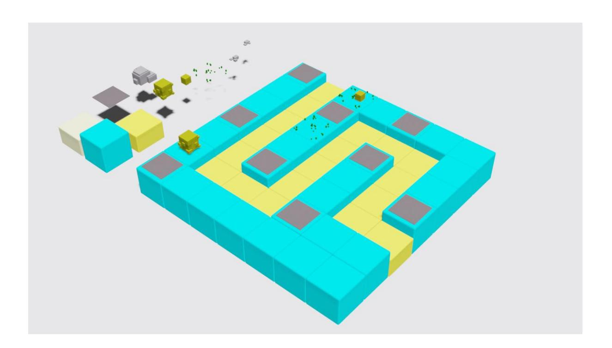

## **[x] Bài tập 1: Hiệu ứng Năng lượng cho đạn bắn**

Làm cho đạn bắn phát ra ánh sáng hoặc vệt sáng năng lượng khi bay.

Gợi ý :

Sử dụng Shader Graph với **Trail Renderer**

Thêm hiệu ứng **Additive Blending** để đạn sáng hơn trong môi trường.

Cách làm :

#### **Thêm Trail Renderer**

### 1. **Gắn Trail Renderer vào đạn**:

- Trong **Inspector**, chọn **Add Component** > **Trail Renderer**.
- Trail Renderer sẽ vẽ ra một vệt sáng theo chuyển động của đạn.

### 2. **Cấu hình Trail Renderer**:

- **Time**: Điều chỉnh thời gian tồn tại của vệt sáng (ví dụ: 0.5 1 giây).
- **Start Width**: Đặt độ rộng đầu vệt sáng (ví dụ: 0.2).
- **End Width**: Đặt độ rộng cuối vệt sáng (ví dụ: 0).
- **Color Gradient**: Tạo màu gradient cho vệt sáng (ví dụ: từ trắng sang xanh lam hoặc bất kỳ màu nào bạn muốn).
- **Material**: Đặt một material mới để kiểm soát giao diện vệt sáng.

### Thêm hiệu ứng **Additive Blending**

### **Tạo Shader Graph**:

- Vào **Assets**, chuột phải > **Create > Shader > Unlit Shader Graph**.
- Đặt tên là BulletTrailShader.

## **Cấu hình Shader Graph**:

- **Additive Blending**:
  - Vào **Graph Settings** (góc trên phải của Shader Graph).
  - Chọn **Surface Type**: Transparent.
  - Chọn **Blending Mode**: Additive.
  - Điều này làm cho vệt sáng trở nên sáng hơn khi chồng lên nhau.
- **Thêm màu động**:
  - Thêm một **Color Property** (đặt tên là Trail Color) và kết nối nó với đầu vào **Base Color** của Master Node.
  - Sử dụng **HDR Color** để tạo hiệu ứng phát sáng (bật **Emission** nếu cần).
- **Hiệu ứng phát sáng (Glow)**:
  - Thêm một **Emission Node** và nối giá trị của **Trail Color** vào đó.
  - Tăng giá trị **Emission Intensity** để làm vệt sáng rực rỡ hơn.

### **Lưu và gán Material**:

- Tạo một **Material** mới từ Shader Graph (BulletTrailShader).
- Gán Material này vào **Trail Renderer** của đạn.

## **[x] Bài tập 2: Hiệu ứng Nổ khi Đạn Va Chạm**

Khi đạn va chạm với Quái sẽ tạo ra hiệu ứng Nổ Gợi ý :

### **Tạo VFX Graph**:

● Tạo một VFX Graph mới, ví dụ: ExplosionVFX.

### **Cấu hình VFX Graph**:

● Sử dụng **Sphere Output** để tạo vụ nổ với các hạt phát ra từ trung tâm.

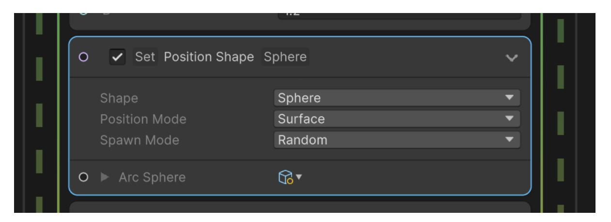

● Thêm **Burst Spawn** để hạt chỉ được sinh ra một lần khi va chạm.

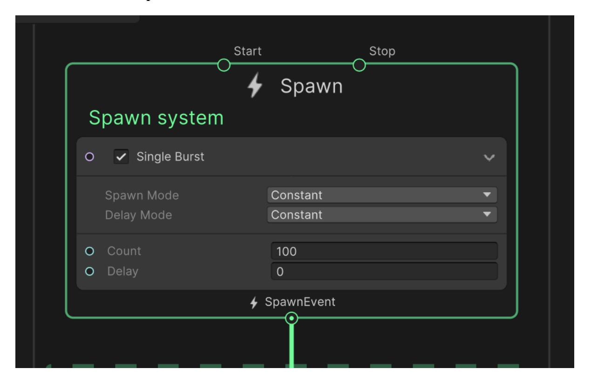

● Sử dụng **Color Over Life** để làm hạt sáng dần và mờ đi.

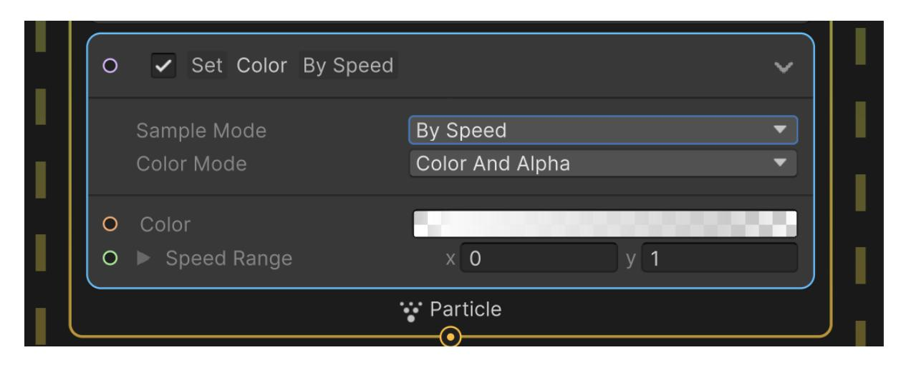

Thêm Câu lệnh sinh vụ nổ và Destroy viên đạn khi va chạm

## **[x] Bài 3 : Tạo hiệu ứng tuyết rơi cho Game**

Bổ sung hiệu ứng tuyết rơi bằng Shader Graph hoặc VFX Graph

**[x] Bài 4 : Tạo hiệu ứng Sticker hay Decal sử dụng Decal Shader In hình logo FPT lên khối Cube hoặc bức tường**

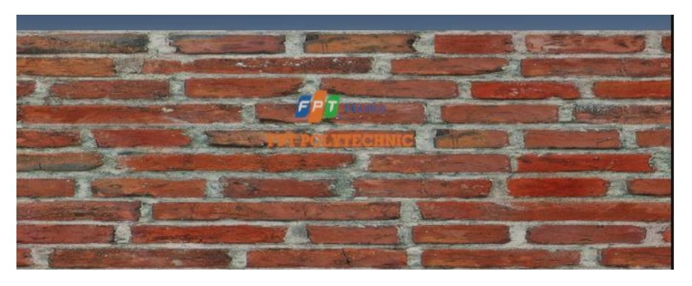

**Gợi ý : Sử dụng HDRP Project)** 

Bước 1 : Tạo 1 GameObject mới trên Scene, thêm Component HDRP Decal Projector

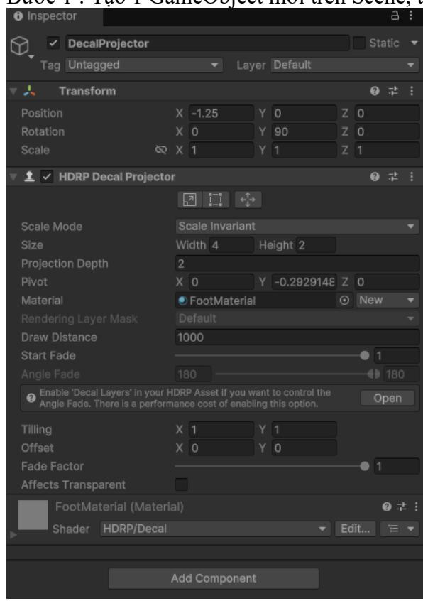

Trong đó : Size là tỉ lệ kích thước tương đương với Logo. Ví dụ ảnh logo có kích thước 200x100 thì Size : 2 : 1

Bước 2 : Tạo mới 1 Material dùng để thể hiện ảnh Logo . Bấm chuột phải trên thư mục Assets chọn Create -> Material

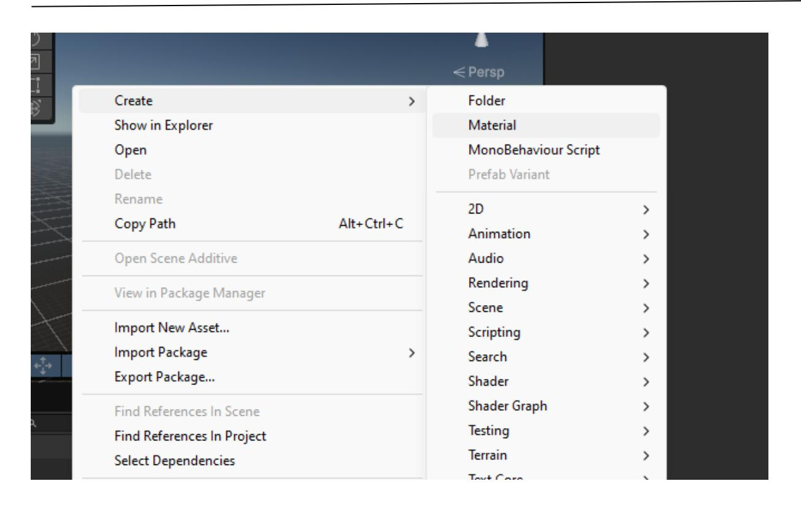

Bước 3 : Trên mục tìm kiếm của Material vừa tạo, nhập Decal và chọn Decal (HDRP)

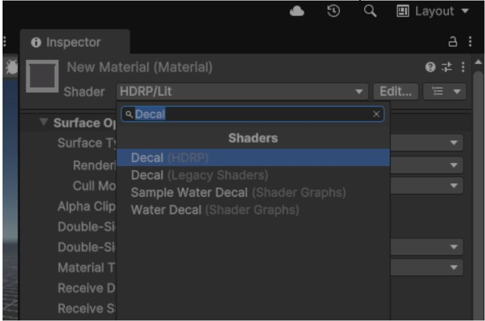

Bước 4 : Kéo ảnh Logo vào tùy chọn BaseMap để nạp ảnh vào Material

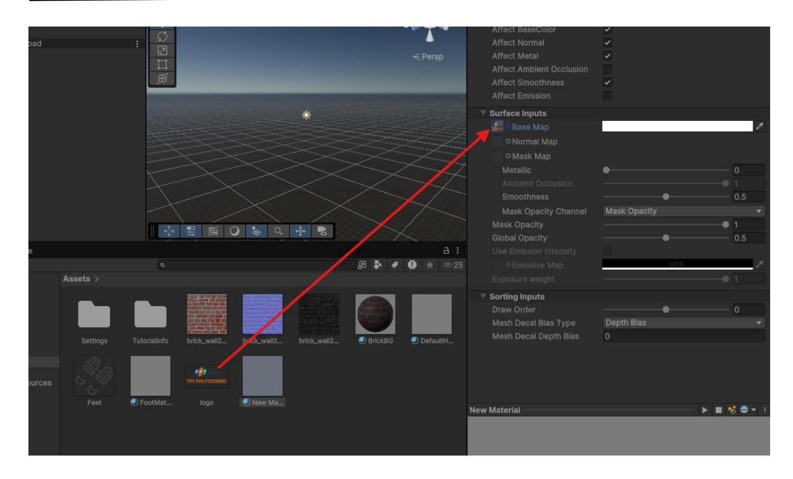

Bước 5 : Kéo Material đó vào mục Material của Component HDRP Decal Projector đã tạo ở bước 1

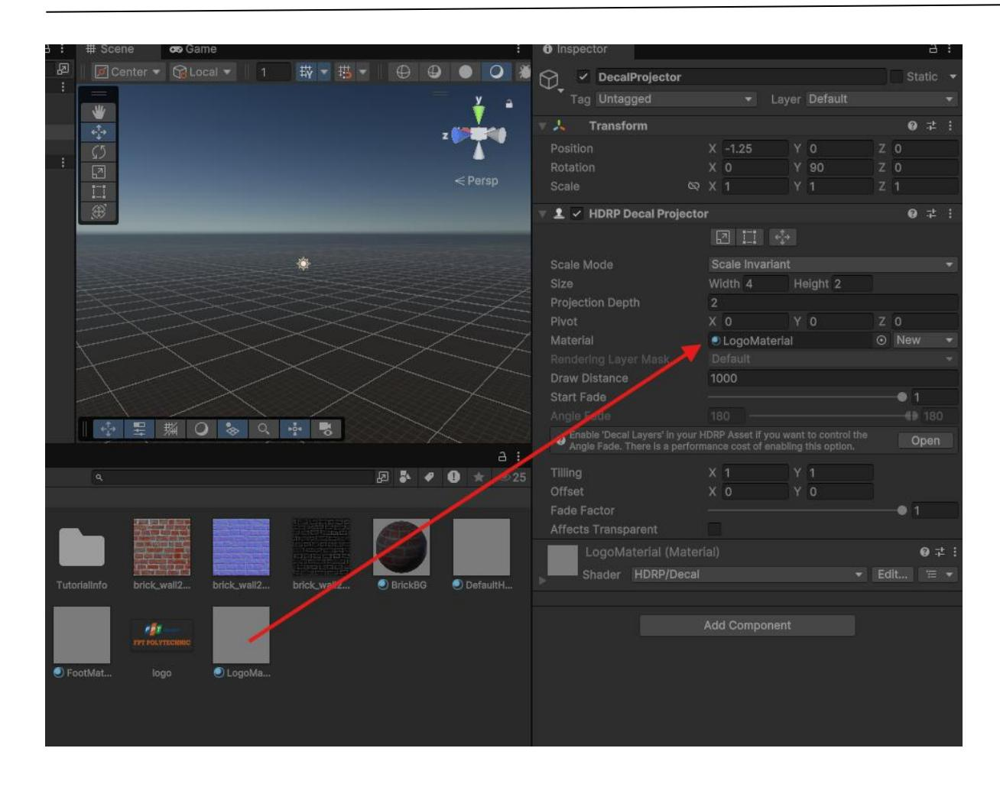

Bước 6 : Sử dụng công cụ Scene Tools điều khiển vị trí, góc xoay để GameProject chứa Decal tiếp xúc với bề mặt cần hiển thị Decal

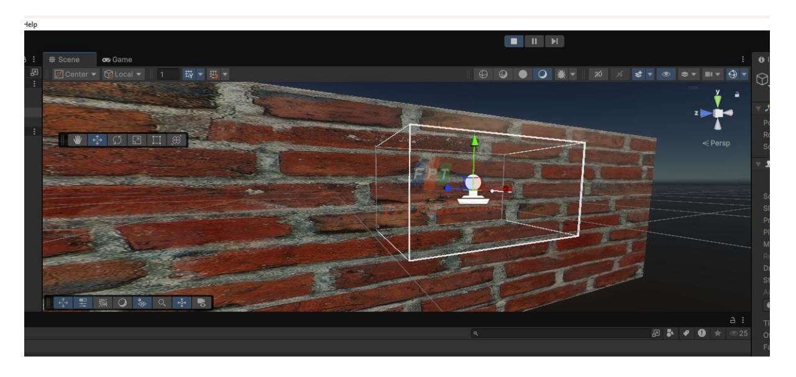

### **[x] Bài 5 : Tạo hiệu ứng mờ (blur) cho toàn màn hình**

## **Gợi ý : Sử dụng FullScreen Shader Graph**

**Fullscreen Shader Graph áp dụng hiệu ứng lên toàn bộ màn hình, thường sử dụng cho:**

Hiệu ứng hậu kỳ (Post-processing): Motion blur, bloom, vignette, hoặc grayscale.

Hiệu ứng UI đặc biệt: Làm mờ nền khi hiện popup.

Hiệu ứng màn hình động: Glitch, scanline, noise, hoặc distortion.

Chuyển cảnh (Transitions): Làm mờ dần hoặc hiệu ứng sóng lan tỏa khi thay đổi màn hình.

Hoặc các hiệu ứng phức tạp hơn như : nhân vật bị tấn công, đóng băng …

## Cách làm : Tạo dự án Unity dạng HDRP 3D

Bước 1 : Truy cập GameObject -> Volume -> Custom Pass

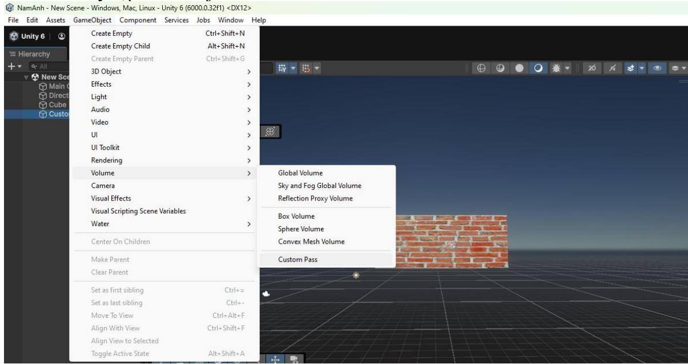

Trong Custom Pass , Tùy chọn hiệu ứng áp dụng lên Camera

Mode : Camera

Target Camera : Kéo chọn Camera hiện tại trên Scene

Bấm chọn + thêm tùy chọn hiệu ứng Full Screen Custom Pass

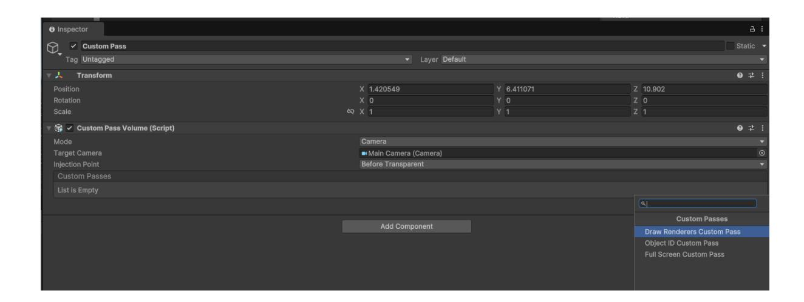

Bước 2 : Ở thư mục Assets bấm chuột phải chọn Create -> Shader Graph -> HDRP -> Fullscreen Shader Graph

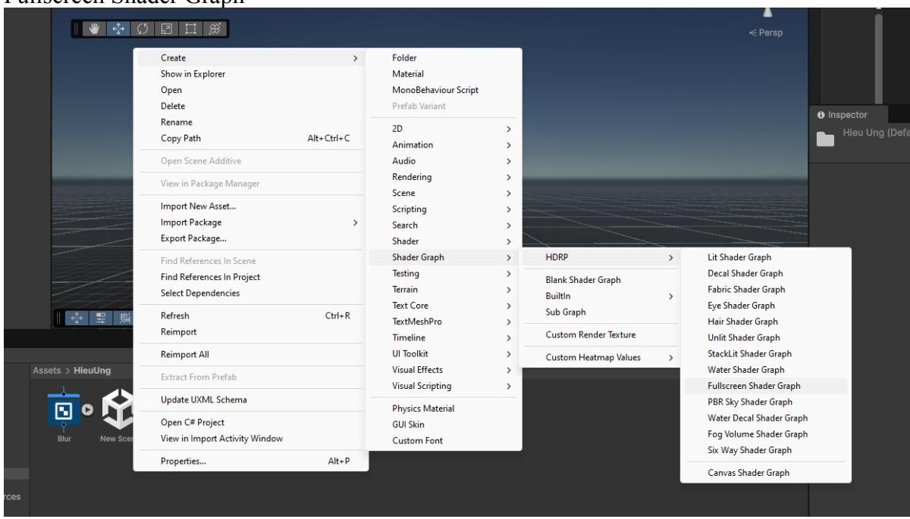

Mở Graph vừa tạo, bổ sung thêm Node HD Scene Color để tùy chỉnh độ mờ của background Thay đổi giá trị X để làm tăng, giảm độ mờ

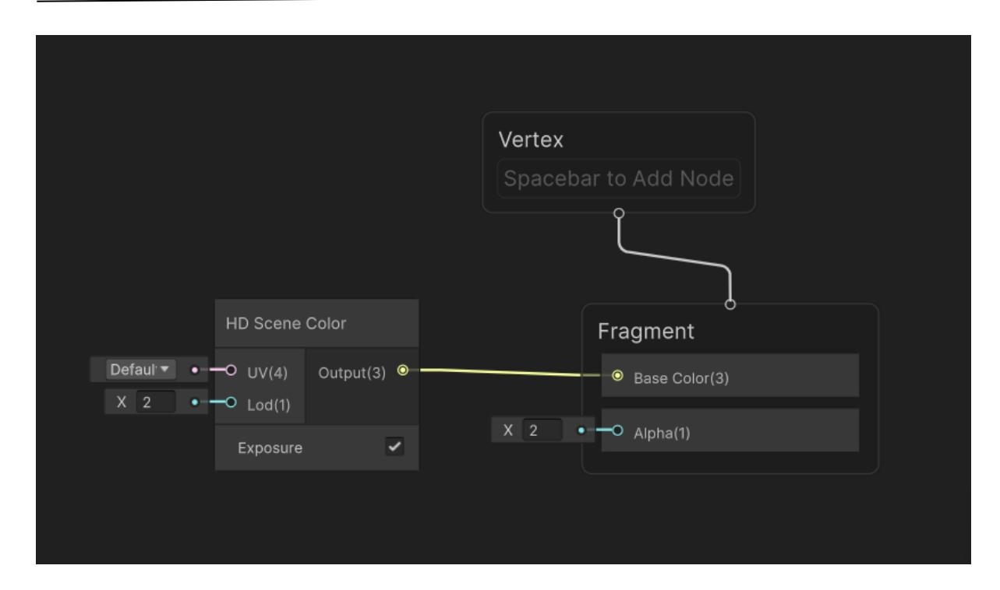

Bước 3 : Liên kết Graph vào Custom Pass Bấm chuột phải vào file FullScreen Graph chọn Create -> Material Kéo Material vừa tạo vào mục Material của Custom Pass đã tạo trước đó

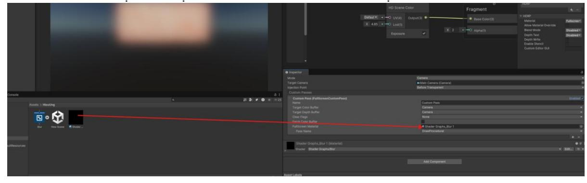

Kết quả : toàn bộ màn hình đã bị phủ hiệu ứng Blur - Làm mờ

--- Hết ---