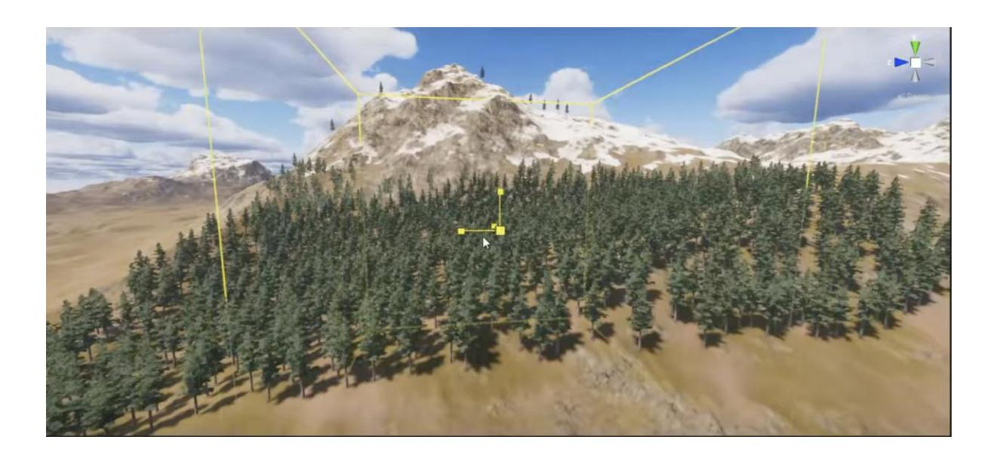
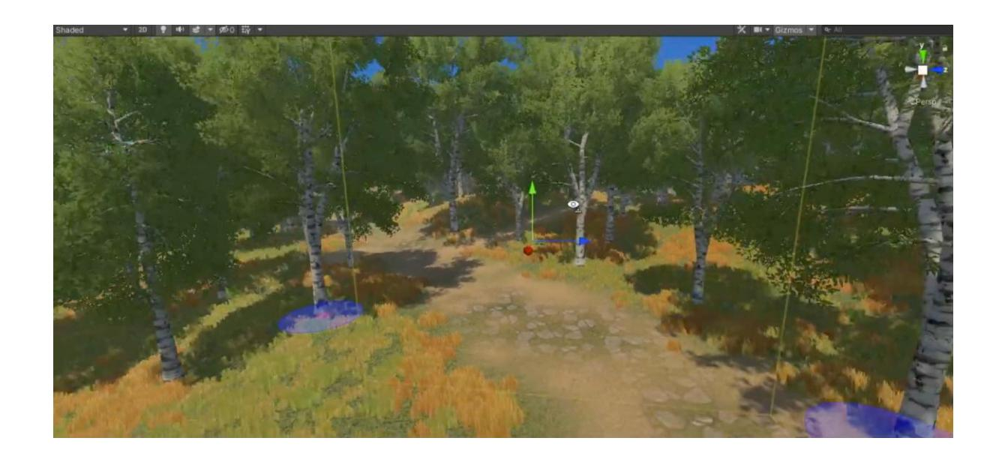

# **Lab 6**

## **MỤC TIÊU**

Kết thúc bài thực hành sinh viên có khả năng:

✓Hiểu và áp dụng **Terrains Tool**

✓Hiểu và áp dụng thuật toán sinh địa hình tự nhiên

Tài nguyên :<https://assetstore.unity.com/packages/tools/terrain/mega-world-free-207301>

#### **NỘI DUNG**

Sinh viên sử dụng tài nguyên đính kèm, thiết kế địa hình phong cảnh như hình :

### **[x] Bài tập 1: Thiết kế rừng cây với núi tuyết**

### **Gợi ý : Sử dụng thuật toán Perlin Noise để sinh địa hình tự nhiên**

**[x] Bài tập 2: Thiết kế rừng cây có độ dốc** 

#### **Gợi ý : Dùng kết hợp Perlin Noise và Linear Gradient , tạo ra địa hình dốc 1 chiều nhưng lồi lõm tự nhiên**

**[x] Bài 3 : Áp dụng thuật toán thêm cây cối hoặc vật phẩm xuất hiện random trên địa hình**

**[x] Bài 4 : Giảng viên giao thêm bài tập**

--- Hết ---