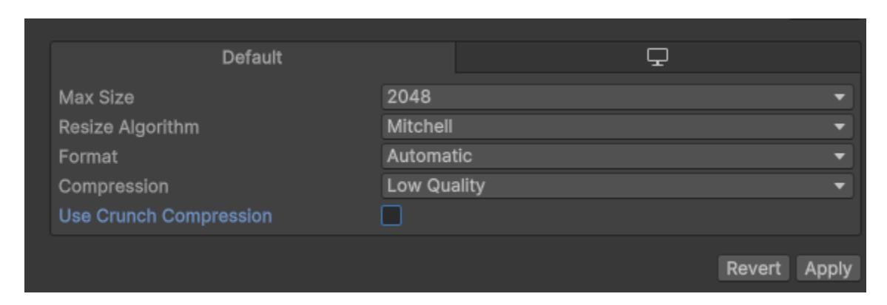
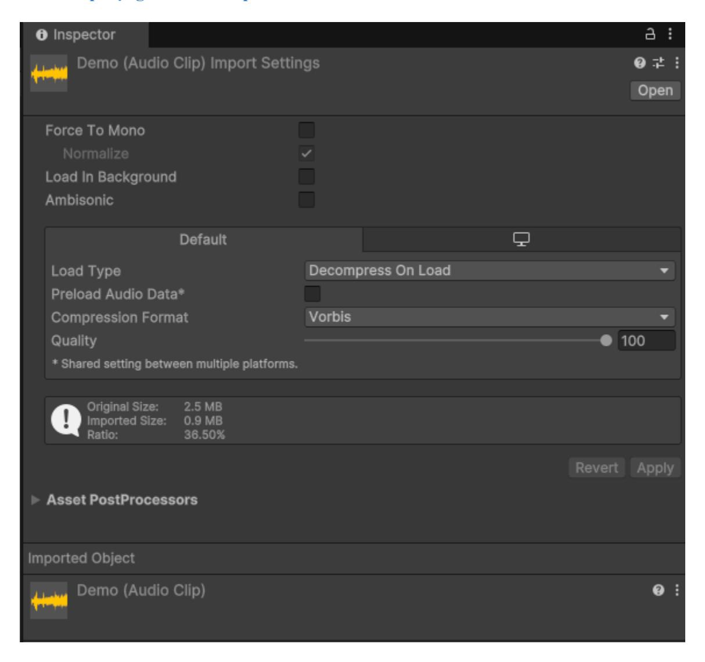

# **Lab 7**

# **MỤC TIÊU**

Kết thúc bài thực hành sinh viên có khả năng:

✓Hiểu và áp dụng **Object Pooling** 

✓Hiểu và áp dụng **Occlusion Culling**

## **NỘI DUNG**

## **Bài tập 1: Áp dụng Object Pooling cho bài Lab 5**

Sau khi áp dụng Object Pooling, kiểm tra Stat và đưa ra các chỉ số thay đổi trước và sau khi áp dụng Object Pooling như : CPU, Batches, FPS …

## **Bài tập 2: Áp dụng Occlusion Culling cho bài Lab 6**

Sau khi áp dụng Occlusion Culling nhận xét thay đổi của các chỉ số Stat như CPU, FPS, Batches …

## **Bài 3 : Áp dụng Texture Compression**

Nén texture để giảm bộ nhớ GPU.

Gợi ý : Tùy chỉnh chất lượng của Texture để giảm tối đa dung lượng của dự án Game, nhận xét thay đổi của chất lượng hình ảnh và dung lượng tổng thể của dự án

**Max Size** : Đặt kích thước tối đa của texture. Texture lớn hơn kích thước này sẽ được tự động scale về kích thước đã chọn.

## **Resize Algorithm** :

Mitchell – Giữ lại chi tiết tốt, cân bằng giữa chất lượng và tốc độ.

Bilinear – Nhanh nhưng có thể làm texture bị mờ.

Nearest Neighbor – Đơn giản và nhanh nhưng có thể gây ra hiện tượng "blocky".

Lanczos – Chất lượng cao, nhưng chậm nhất.

## **Compression** : Chất lượng nén của texture.

Low Quality – Tốc độ nén nhanh, kích thước nhỏ nhất nhưng giảm chất lượng đáng kể.

Normal Quality – Cân bằng giữa chất lượng và dung lượng.

High Quality – Kích thước lớn hơn nhưng giữ nguyên chi tiết tốt nhất.

## **Use Crunch Compression** :

Bật/Tắt – Khi bật, texture sẽ được nén bằng crunch và giảm đáng kể kích thước file.

**Bài 4 : Áp dụng Sound Compression**

Force To Mono : Chuyển âm thanh stereo (2 kênh) thành mono (1 kênh) nếu có thể Normalize : Điều chỉnh âm lượng của audio clip để đạt mức lớn nhất có thể mà không bị méo tiếng

Load In Background : Cho phép clip được tải trong nền thay vì chặn tiến trình chính khi load scene.

Ambisonic : Kích hoạt chế độ âm thanh vòm (Ambisonic), thường dùng cho VR hoặc môi trường 3D phức tạp.

## **Load Type**

Decompress On Load:

Giải nén âm thanh ngay khi load scene, tốn RAM nhưng không tốn CPU khi phát.

Dùng cho: Âm thanh ngắn hoặc khi bạn có đủ RAM.

Compressed In Memory:

Lưu âm thanh dưới dạng nén trong bộ nhớ và giải nén khi phát.

Dùng cho: Âm thanh dài hoặc thiết bị có RAM hạn chế.

Streaming:

Phát âm thanh trực tiếp từ ổ đĩa mà không lưu vào bộ nhớ.

Dùng cho: Nhạc nền hoặc đoạn hội thoại dài.

## **Preload Audio Data**

Khi bật, audio clip sẽ được tải trước vào RAM khi load scene.

## **Quality** :

Điều chỉnh mức độ nén của âm thanh (chỉ áp dụng với Vorbis và MP3).

Chất lượng cao (100): Ít nén, chất lượng tốt, kích thước file lớn.

Chất lượng thấp (dưới 50): Nén mạnh, kích thước file nhỏ, nhưng có thể làm méo âm thanh.

Sinh viên sử dụng các thuộc tính trên để tùy chỉnh giảm dung lượng file âm thanh

**Bài 5 : Giảng viên giao thêm bài tập**

--- Hết ---